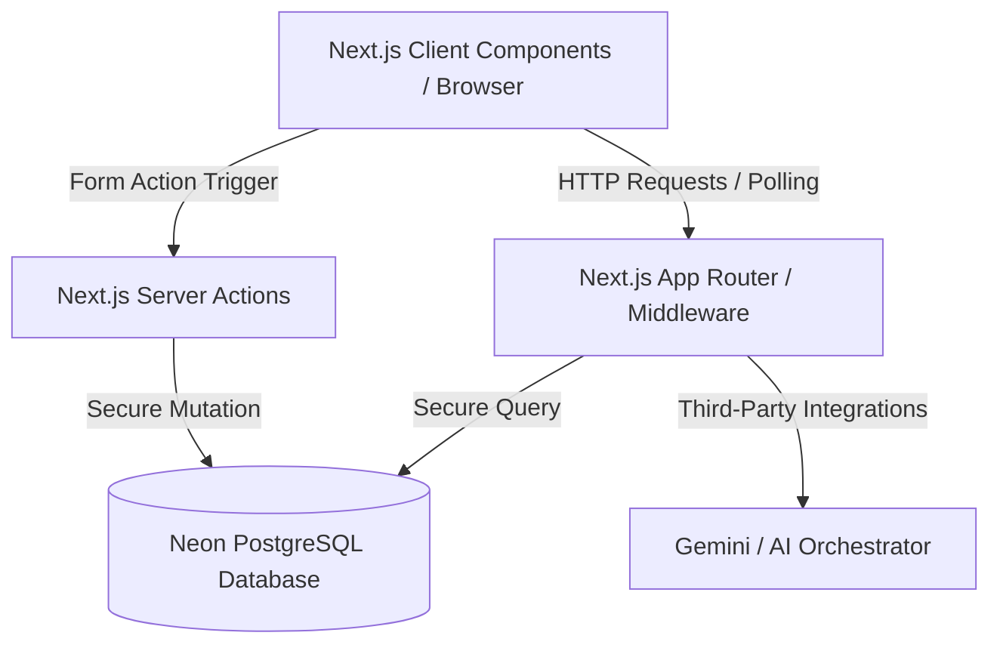

# Junto Travel Companion — Architecture & Security Audit

This document provides a comprehensive overview of Junto's system architecture, database schema, data models, and identified security gaps. It is formatted for direct evaluation by Claude or other AI-driven application security tools.

---

## 1. System Architecture Overview

Junto is a serverless, collaborative trip planning and expense-sharing application built using **Next.js 16** (App Router) and **PostgreSQL** (Neon Serverless Postgres).



### Key Architectural Patterns
1. **Hybrid Rendering**: Page entries query database records via Server Components to pre-render initial views, passing data to Client Components (`*Client.tsx`) for real-time polling sync.
2. **Realtime Polling Sync**: Client views query `/api/trip/[tripId]/sync` every 3 seconds to fetch dynamic updates for chat messages, decisions, checklist items, and expenses.
3. **Decoupled User Identity**: Users exist globally in a unified `users` table, while trip-specific memberships map to a distinct `members` table.
4. **State Machine Plan Lock**: Proposals (`decisions`) start in an `open` status. Group members cast votes on choices (`options`). When consensus is reached or forced, a decision status changes to `locked` and references the `resolved_option_id`.

---

## 2. Database Schema Model (PostgreSQL)

Below is the structured relational layout of the Neon Postgres database.

### Core Tables

#### `users`
Represents the global user profile across all trips.
```sql
CREATE TABLE users (
  id UUID PRIMARY KEY DEFAULT gen_random_uuid(),
  auth_id VARCHAR(255) UNIQUE NOT NULL, -- User ID from oauth/auth provider
  name VARCHAR(255) NOT NULL,
  email VARCHAR(255) NOT NULL,
  photo_url TEXT,
  phone VARCHAR(50),
  home_currency VARCHAR(10) DEFAULT 'INR',
  upi_id VARCHAR(255),
  chat_prefs JSONB NOT NULL DEFAULT '{"notifications": true, "mentions_only": false}'::jsonb,
  created_at TIMESTAMP WITH TIME ZONE DEFAULT CURRENT_TIMESTAMP
);
```

#### `trips`
Container representing a single travel group plan.
```sql
CREATE TABLE trips (
  id UUID PRIMARY KEY DEFAULT gen_random_uuid(),
  name VARCHAR(255) NOT NULL,
  status VARCHAR(50) NOT NULL DEFAULT 'planning' CHECK (status IN ('planning', 'active', 'done')),
  base_currency VARCHAR(10) NOT NULL DEFAULT 'INR',
  invite_token VARCHAR(255) UNIQUE NOT NULL,
  created_at TIMESTAMP WITH TIME ZONE DEFAULT CURRENT_TIMESTAMP
);
```

#### `members`
Trip-specific participant record mapping a global `user` to a specific `trip`.
```sql
CREATE TABLE members (
  id UUID PRIMARY KEY DEFAULT gen_random_uuid(),
  trip_id UUID NOT NULL REFERENCES trips(id) ON DELETE CASCADE,
  user_id UUID REFERENCES users(id) ON DELETE CASCADE, -- Linked profile (nullable for legacy/invited-only accounts)
  name VARCHAR(255) NULL, -- Optional name override
  status VARCHAR(50) NOT NULL DEFAULT 'invited' CHECK (status IN ('invited', 'confirmed', 'maybe', 'out')),
  roles TEXT[] NOT NULL DEFAULT '{}', -- e.g., {'organizer'}
  auth_id VARCHAR(255) NULL,
  upi_id VARCHAR(255) NULL,
  created_at TIMESTAMP WITH TIME ZONE DEFAULT CURRENT_TIMESTAMP
);
```

### Messaging & Decision-Making Tables

#### `messages`
Stores trip-specific chat stream logs.
```sql
CREATE TABLE messages (
  id UUID PRIMARY KEY DEFAULT gen_random_uuid(),
  trip_id UUID NOT NULL REFERENCES trips(id) ON DELETE CASCADE,
  author_id UUID REFERENCES members(id) ON DELETE SET NULL,
  is_ai BOOLEAN NOT NULL DEFAULT false,
  body TEXT NOT NULL,
  metadata JSONB NULL,
  created_at TIMESTAMP WITH TIME ZONE DEFAULT CURRENT_TIMESTAMP
);
```

#### `decisions`
Represents an agenda item requiring group alignment.
```sql
CREATE TABLE decisions (
  id UUID PRIMARY KEY DEFAULT gen_random_uuid(),
  trip_id UUID NOT NULL REFERENCES trips(id) ON DELETE CASCADE,
  type VARCHAR(50) NOT NULL CHECK (type IN ('dates', 'destination', 'hotel', 'budget', 'logistics', 'custom')),
  title VARCHAR(255) NOT NULL,
  status VARCHAR(50) NOT NULL DEFAULT 'open' CHECK (status IN ('open', 'locked', 'rejected')),
  resolved_option_id UUID NULL REFERENCES options(id) ON DELETE SET NULL,
  created_from_message_id UUID REFERENCES messages(id) ON DELETE SET NULL,
  created_at TIMESTAMP WITH TIME ZONE DEFAULT CURRENT_TIMESTAMP
);
```

#### `options`
Mutually exclusive choices proposed for a decision.
```sql
CREATE TABLE options (
  id UUID PRIMARY KEY DEFAULT gen_random_uuid(),
  decision_id UUID NOT NULL REFERENCES decisions(id) ON DELETE CASCADE,
  label VARCHAR(255) NOT NULL,
  payload JSONB NOT NULL DEFAULT '{}'::jsonb, -- Holds structured metadata (e.g. rangeStart, rangeEnd)
  proposed_by UUID REFERENCES members(id) ON DELETE SET NULL,
  created_at TIMESTAMP WITH TIME ZONE DEFAULT CURRENT_TIMESTAMP
);
```

#### `votes`
Saves choices made by members.
```sql
CREATE TABLE votes (
  id UUID PRIMARY KEY DEFAULT gen_random_uuid(),
  decision_id UUID NOT NULL REFERENCES decisions(id) ON DELETE CASCADE,
  option_id UUID NOT NULL REFERENCES options(id) ON DELETE CASCADE,
  member_id UUID NOT NULL REFERENCES members(id) ON DELETE CASCADE,
  value VARCHAR(20) NOT NULL CHECK (value IN ('yes', 'no', 'abstain')),
  created_at TIMESTAMP WITH TIME ZONE DEFAULT CURRENT_TIMESTAMP,
  CONSTRAINT unique_option_member_vote UNIQUE (option_id, member_id)
);
```

### Expense Ledger Tables

#### `expenses`
Entries representing logged group payments.
```sql
CREATE TABLE expenses (
  id UUID PRIMARY KEY DEFAULT gen_random_uuid(),
  trip_id UUID NOT NULL REFERENCES trips(id) ON DELETE CASCADE,
  paid_by UUID NOT NULL REFERENCES members(id) ON DELETE CASCADE,
  amount NUMERIC(12, 2) NOT NULL,
  currency VARCHAR(10) NOT NULL DEFAULT 'INR',
  fx_rate NUMERIC(12, 6) NOT NULL DEFAULT 1.0,
  description VARCHAR(255) NOT NULL,
  category VARCHAR(50) NOT NULL DEFAULT 'Other',
  date TIMESTAMP WITH TIME ZONE NOT NULL DEFAULT CURRENT_TIMESTAMP,
  split_type VARCHAR(20) NOT NULL DEFAULT 'equal' CHECK (split_type IN ('equal', 'shares', 'exact')),
  source VARCHAR(20) NOT NULL DEFAULT 'manual' CHECK (source IN ('manual', 'ai-draft')),
  created_at TIMESTAMP WITH TIME ZONE DEFAULT CURRENT_TIMESTAMP
);
```

#### `splits`
Tracks split distributions per participant.
```sql
CREATE TABLE splits (
  id UUID PRIMARY KEY DEFAULT gen_random_uuid(),
  expense_id UUID NOT NULL REFERENCES expenses(id) ON DELETE CASCADE,
  member_id UUID NOT NULL REFERENCES members(id) ON DELETE CASCADE,
  weight NUMERIC(10, 2) NULL, -- Weight value used if split_type = 'shares'
  exact_amount NUMERIC(12, 2) NULL, -- Exact amount owed if split_type = 'exact'
  created_at TIMESTAMP WITH TIME ZONE DEFAULT CURRENT_TIMESTAMP,
  CONSTRAINT unique_expense_member_split UNIQUE (expense_id, member_id)
);
```

---

## 3. Session & Authentication Management

Junto maps user identity and trip context using cookie storage:

1. **User Identity Session (`junto_user_id`)**:
   - Set during onboarding or sign-in (`/api/user/onboard`).
   - Expire time: 30 days.
   - Value: Holds the raw plaintext UUID of the `users` table record.
   - Read by the server via `cookies().get('junto_user_id')`.
2. **Trip Member Context (`junto_member_[tripId]`)**:
   - Set when a guest joins a trip or when a creator accesses their trip dashboard.
   - Value: Stringified JSON payload (e.g. `{"memberId": "uuid", "memberName": "name", "role": "member"}`).
   - Used for quick client-side and inline context checks.

---

## 4. Identified Security Vulnerabilities

Below are critical security flaws identified in the current Junto codebase that require correction before staging or production deployment:

### Gap A: Plaintext, Unsigned, and Non-HTTPOnly Cookies (Session Hijacking)
* **Vulnerability Description**: The authentication token (`junto_user_id`) is stored as a raw, plaintext database user UUID without encryption or cryptographic signatures (HMAC).
* **Impact**:
  1. **Session Spoofing**: Since the server maps database identity directly from the cookie string value, an attacker can modify their cookie to any known UUID (BOLA/IDOR) to assume the identity of *any* registered traveler on the system.
  2. **XSS Theft**: The `junto_user_id` cookie is set with `httpOnly: false`. If a cross-site scripting (XSS) vulnerability exists on any page, malicious scripts can read and steal the cookie directly via `document.cookie`.
* **Fix Recommendation**:
  - Implement standard JWTs or signed session cookies using secure backend middlewares.
  - Set all authentication cookies as `httpOnly: true`, `secure: true`, and `sameSite: 'lax'`.

### Gap B: Client-Tamperable Member Context Cookie (`junto_member_[tripId]`)
* **Vulnerability Description**: Next.js Server Components and API endpoints occasionally load the active member role context directly by parsing the raw `junto_member_[tripId]` cookie payload (`JSON.parse(memberCookie.value)`).
* **Impact**: An attacker can modify their client cookie payload (e.g. manually set `role: "organizer"`) to attempt administrative mutations, bypassing authorization filters if backend database checks are omitted.
* **Fix Recommendation**: Always verify trip membership and roles directly via server-side database lookup against the authenticated `junto_user_id` instead of relying on parsing cookie payloads.

### Gap C: IDOR / Spoofing in Mutation Endpoints
* **Vulnerability Description**: Mutation API routes (such as `/api/trip/[tripId]/proposal` and `/api/trip/[tripId]/checklist`) extract actor parameters (like `proposedBy` or `assigned_to` UUIDs) directly from the incoming HTTP POST/PUT request body.
* **Impact**: A member of a trip can issue requests spoofing actions on behalf of other trip members by swapping the UUID parameter values inside the HTTP request body.
* **Fix Recommendation**: Ensure that the database entity being mutated is authorized by verifying that the requesting user's verified ID (from the secure session) matches the actor or is authorized to act on behalf of the target UUID.

### Gap D: Hardcoded Developer Auth Backdoor
* **Vulnerability Description**: The server helper `getCurrentUser` in `lib/auth.ts` has a developer fallback mode:
  ```typescript
  if (allowFallback) {
    const userRes = await query("SELECT * FROM users WHERE auth_id = 'default-mudit-garg'");
    ...
  ```
  This returns the operator profile if no user cookie is present.
* **Impact**: If this flag is enabled or left in client-facing server render entry paths in production, it acts as an intentional backdoor permitting full operator-level access to unauthenticated sessions.
* **Fix Recommendation**: Restrict fallback modes strictly to `process.env.NODE_ENV === 'development'` environments.

### Gap E: API Cross-Site Request Forgery (CSRF)
* **Vulnerability Description**: Traditional HTTP API endpoints (like `/api/trip/[tripId]/expense`) are accessed via Client Component `fetch()` calls. Because Next.js App Router API routes do not automatically enforce CSRF tokens, these actions are vulnerable to CSRF since session cookies are sent automatically by the browser.
* **Impact**: A user visiting a malicious external website could trigger automated expense additions or proposal votes on Junto via hidden cross-origin requests.
* **Fix Recommendation**: Enforce CSRF headers or leverage Next.js Server Actions exclusively for state mutations (which utilize built-in CSRF validation tokens).
